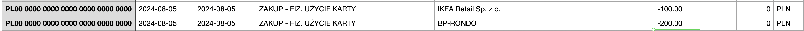
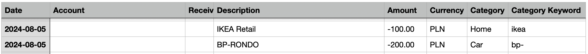

# WhereMoney 🕵️‍♂️

WhereMoney is a simple tool to help you track your expenses and income. It categorizes transactions from your bank into predefined categories. Everything is processed locally on your machine.

The program is written in Scala 3 and uses [Scala CLI](https://scala-cli.virtuslab.org/install).

⚠️ **The application was built for personal use and should be used with caution. Produced results may not be accurate.** ⚠️

The tool reads CSV files exported from your bank and tries to categorize each transaction by account, recipient, and description.

Categories with keywords are customizable in `./config.json` file.

## Example

1. Exported CSV file _`./inputs/millenium.csv`_:
   
2. Generated categorized CSV file _`./outputs/millenium_out.csv`_:
   

## Supported banks

- Millenium - save as _`./inputs/millenium.csv`_
- ING - save as _`./inputs/ing.csv`_
- NEST - save as _`./inputs/nest.csv`_
- NEST EUR - save as _`./inputs/nest_eur.csv`_

## Usage

1. Configure keywords for categories in _`./[EXAMPLE] config.json`_.
   Rename it to _`./config.json`_
2. Export CSV transaction data from bank and save into _`./inputs`_ folder
3. If you do not have _`scala-cli`_ installed, you can install it following instructions from [Scala CLI Installation Guide](https://scala-cli.virtuslab.org/install/).
4. Run _`scala-cli .`_. It will read CSV files from _`./inputs`_ folder and generate categorized .csv files in _`./outputs`_ folder.
5. Some transactions may not be categorized. You can manually categorize them in _`./outputs/BANK_OUT.csv`_ file.
6. Program runs in append mode, so you can run it multiple times and it will append new transactions to existing files. It checks for last processed date in _`./outputs/BANK_OUT.csv`_ file and skips transactions before and on that date.

## Changing predefined categories

1. Change categories by editing _`./config.json`_ file.
2. Change the category in _`./model/Category.scala`_ file.

## Adding more banks

1. Write a parser for the bank's CSV row in _`./BankHandler.scala`_ file.
2. Add new bank in _`SupportedBank`_ Enum.
